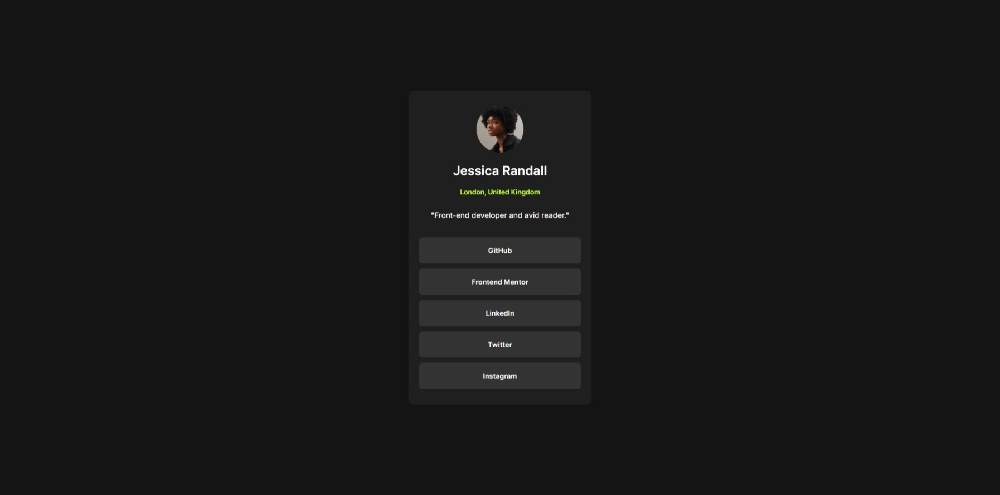

# Frontend Mentor - Social links profile solution

This is a solution to the [Social links profile challenge on Frontend Mentor](https://www.frontendmentor.io/challenges/social-links-profile-UG32l9m6dQ). Frontend Mentor challenges help you improve your coding skills by building realistic projects. 

## Table of contents

- [Overview](#overview)
  - [Screenshot](#screenshot)
  - [Links](#links)
- [My process](#my-process)
  - [Built with](#built-with)
  - [What I learned](#what-i-learned)
  - [Continued development](#continued-development)
  - [Useful resources](#useful-resources)
  - [AI Collaboration](#ai-collaboration)
- [Author](#author)

## Overview

### Screenshot



### Links

- Solution URL: [Frontend Mentor Submitted Solution](https://your-solution-url.com)
- Live Site URL: [Social Links Profile](https://osmond20.github.io/Social-Links-Profile/)

## My process

### Built with

- Semantic HTML5 markup
- CSS custom properties
- Flexbox
- CSS Grid
- Mobile-first workflow
- Focus states

### What I learned
This project gave me hands-on practice with implementing focus states into the project, and gave me 
experience in being more aware not only build to be interacted with a mouse but also a

```css
.links:focus-visible{
  outline: 3px solid white;
  outline-offset:.25rem;
}
```

### Continued development
Will be focusing on mobile-first design to ensure responsive design.

### Useful resources

- [resource 1](https://www.youtube.com/watch?v=K7m13jOby5Q) - helped me figure out how to reduce the font-size responsively without media queries
- [resource 2](https://www.example.com) - Helped me understand and connect in a easy way how focus states can be used in a project

**Note: Delete this note and replace the list above with resources that helped you during the challenge. These could come in handy for anyone viewing your solution or for yourself when you look back on this project in the future.**

### AI Collaboration
I used Gemini for this one, and it helped provide a roadmap or pathway, if you will, to focus on certain topics where I could learn the information, necessary to give me the opportunity to attempt to solve the problem. It worked well for me on the research side, and applying it really helped when applying the information, however I did notice knowledge gaps and that I required that further information.

## Author

- Website - [Social Links site](https://osmond20.github.io/Social-Links-Profile/)
- Frontend Mentor - [@osmond20](https://www.frontendmentor.io/profile/osmond20)
- Github - [osmond20](https://github.com/osmond20)


